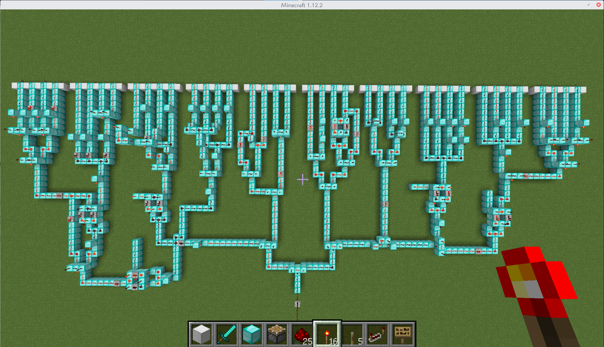

# 猫咪电路

欢迎来到猫咪系列题目之**猫咪电路**。

这道题是一道非常简单的题目，主要是想让同学们学会一些电路逆向技巧。

## 基本概念：
### 红石元件：（引用部分来源：[minecraft wiki](https://minecraft-zh.gamepedia.com/%E7%BA%A2%E7%9F%B3%E7%94%B5%E8%B7%AF))
> 红石元件能够接受红石信号并作出反应（例如移动、发光等），例如活塞、红石灯、发射器等。红石元件是在红石电路里具有一定使用目的的方块，大致分为三个大类，部分电路提供能量来源，例如红石火把、按钮、拉杆、红石块、压力板等。
> 
> 电源为整个电路或部分电路提供能量来源，例如红石火把、按钮、拉杆、红石块、压力板等。
> 
> 传输线将电能从电路的一部分传递到另一部分，例如红石粉、红石中继器、红石比较器等。
> 
> 机械接受电能并作出反应（例如移动、发光等），例如活塞、红石灯、发射器等。
### 充能：
> 红石元件与部分方块能够被充能或解除充能。如果说一个方块被“充能”了，则这个方块就可以作为电源，能向毗邻的“用电”方块供电以使其工作。（“毗邻”是这样定义的：一个方块是正方体，正方体有6个面。也就是说与一个方块的任意一个面接触的方块最多可能有6个，称之为“与该方块毗邻的方块”）。
> 
> 当非透明方块（例如石头、砂岩、泥土等）被电源 （或是中继器、比较器）充能，我们称这个方块被强充能了（这个概念与充能等级不同）。强充能的方块可以激活毗邻的红石线。绝大多数电源可以强充能自身。
> 
> 当非透明方块仅被红石线充能，我们称这个方块被弱充能。被充能的方块（无论强度如何）都可以影响毗邻的红石元件。不同的元件产生的反应不同。您可以查看这些元件的具体描述。
> 
> 没有不透明的方块可以直接为另一个不透明方块充能，因为中间必须有红石粉或其他红石元件。透明方块不能被任何东西充能。“强”与“弱”充能仅适用于不透明的方块，而不适用于红石粉或其他红石元件。
> 
> 被充能的方块（强或弱）会影响相邻的红石组件。不同的红石组件对其反应有所不同。
### 传输：
> 火把高塔与火把梯：红石火把能够充能其上方的方块与相邻的（包括下方的）红石线，这样，纵向传输便成为可能（向上与向下的设计不同）。
> 
> “中继”信号指的是将信号加强到完全信号强度。最简单的方法就是使用红石中继器，包括如下变种：
> 
> - 瞬时中继器： 在不引入延迟的情况下中继信号。
> - 双向中继器： 可以从来回两个方向中继信号。
> 
>  “二极管”指只允许信号单向传输的电路，通常用于防止电路反向干扰引起的状态改变或延迟紊乱，也可以用于防止大型电路中的线路彼此串扰。常用的二极管包括红石中继器、一格高的荧石与无法向斜下方传输信号的倒置台阶。
> 
> 很多电路已经具有单向性，因为它们的输出端不会接受输入信号，例如以附着在方块侧面的红石火把作为输出的电路。 
### 逻辑电路：
>  有时，你需要判断输入信号，经过一定的算法产生一个输出。这类电路即为人们耳熟能详的逻辑门（“门”只让满足“逻辑”的信号输出）。

本题目即为使用逻辑电路，将选手输入的 40 位信号转换成为一位信号，用该信号驱动活塞移动染色玻璃，达到使信标变色的目的。
## 逻辑门：
- 与门：两个输入信号均为真时输出为真，其余为假
- 或门：两个输入信号均为假时输出为假，其余为真
- 非门：将输入信号反向（即真变为假，假变为真），(由于红石火把附着方块被充能时红石火把会熄灭，因此使用红石火把构建非门。)
- 异或门：两个输入信号相同时输出信号为假，相异时为真
- 同或门：两个输入信号相同时输出信号为真，相异时为假
- 与非门：两个输入信号均为真时输出为假，其余为真
- 或非门：两个输入信号均为假时输出为真，其余为假
- 逻辑门在红石电路中的构建在题目出生点均有演示，[minecraft wiki](https://minecraft-zh.gamepedia.com/%E6%95%99%E7%A8%8B/%E5%9F%BA%E6%9C%AC%E9%80%BB%E8%BE%91%E9%97%A8) 中也有说明

## 题目解析：
电路采用树形结构，每四个输入信号一组，将每组信号内部的四个输入信号作运算，再将十组的输出信号之间进行运算得到最终控制信标颜色的信号。

因此较为简便的解法是对每组分别求解。可以通过控制信标颜色的最终信号推导每组的输出信号，再对每组内部进行分析，求出使得该组输出信号正确的输入组合，然后顺序拼接得到 flag.

flag{0110101000111100101111111111111111111010}
